 

# Python Trading Code

> This repo houses python code about topics related to testing, trading and researching forex strategies. The code can be adapted for cryptocurrencies or other tradable asset classes.  

Table of Contents
=================

 * [Testing Forex Strategies](#testing-forex-strategies) 
 * [Support and Resistance](#support-and-resistance)
    * [Methods](#methods)
    * [References](#references)
 * [20 pips challenge](#20-pips-challenge) 
    * [EMA, RSI and Fractals](#ema-rsi-fractals)
    * [EMA Scalping](#ema-scalping)
 * [Automate Chart Patterns](#automate-chart-patterns)
     * [Head and Shoulders Patterns](#head-and-shoulders-patterns)
     * [Inverse Head and Shoulders Patterns](#inverse-head-and-shoulders-patterns)
     * [Triple top and bottom Patterns](#triple-top-and-bottom-patterns)
     * [Rectangle Patterns](#rectangle-patterns)
     * [Wedge Patterns](#wedge-patterns)
     * [Flag Patterns](#flag-patterns)
 * [MACD](#macd)
 * [Short Content](#short-content)
     * [42Dollars](#42dollars)
     * [Bullish Candlesticks](#bullish-candlesticks)
 * [Retracement](#retracement) 
     * [Results](#results)
     * [Example of Trends and Retracements signal](#example-of-trends-and-retracements-signal)
     * [Retracement References](#retracement-references)
 * [Code Trading](#code-trading)
 * [Data](#data)
 * [License](#license)
 * [Contact](#contact)
 * [Buy me coffee](#buy-me-coffee)
 * [Disclaimer](#disclaimer)

## Testing Forex Strategies

> Please note this section was rewritten with ChatGPT, May 3 version. 

Hey there! I'm always on the lookout for fresh and exciting ideas to try out. That's why I spend a good chunk of my time diving into books, blogs, papers, and even watching YouTube videos for some strategy inspiration. It's amazing how much you can learn from these sources!

Speaking of strategies, I've collected a bunch of Python code in this folder. These are strategies that I stumbled upon during my research and thought they were worth putting to the test. I've even categorized them for easier navigation:

  - First, we have strategies I discovered on YouTube. You know, those hidden gems shared by 'experts' in the field.
    
  - Then we have strategies from books, because there's nothing like some good old-fashioned wisdom between the pages. 
  
  - Of course, I couldn't miss out on strategies that were requested by fellow enthusiasts. It's always interesting to explore new ideas brought to the table.
  
  -  Next up, we've got strategies from blogs, where some fantastic minds share their insights and experiences.
   
  - Last but not least, we have chart pattern strategies, because patterns in the charts can hold valuable clues for successful trading.

If you're curious and want to take a peek at the details, I've got you covered. Just head over to the project's documentation [here](https://zeta-zetra.github.io/docs-forex-strategies-python/). Feel free to explore and let me know if you have any questions or suggestions!

Below we show the current top 10 results. Please note the following: 

   -  Starting balance: $10,000
   -  Margin: 1:100
   -  Commission: None
   -  Testing period: From January 1, 2020, to December 31, 2022
   -  Timeframe: 15 minutes
   -  Currency pair: EURUSD
   -  Data Source: Dukascopy 

Also note the limitations outlined in the [documentation](https://zeta-zetra.github.io/docs-forex-strategies-python/).

  <a href="https://github.com/zeta-zetra/code">
    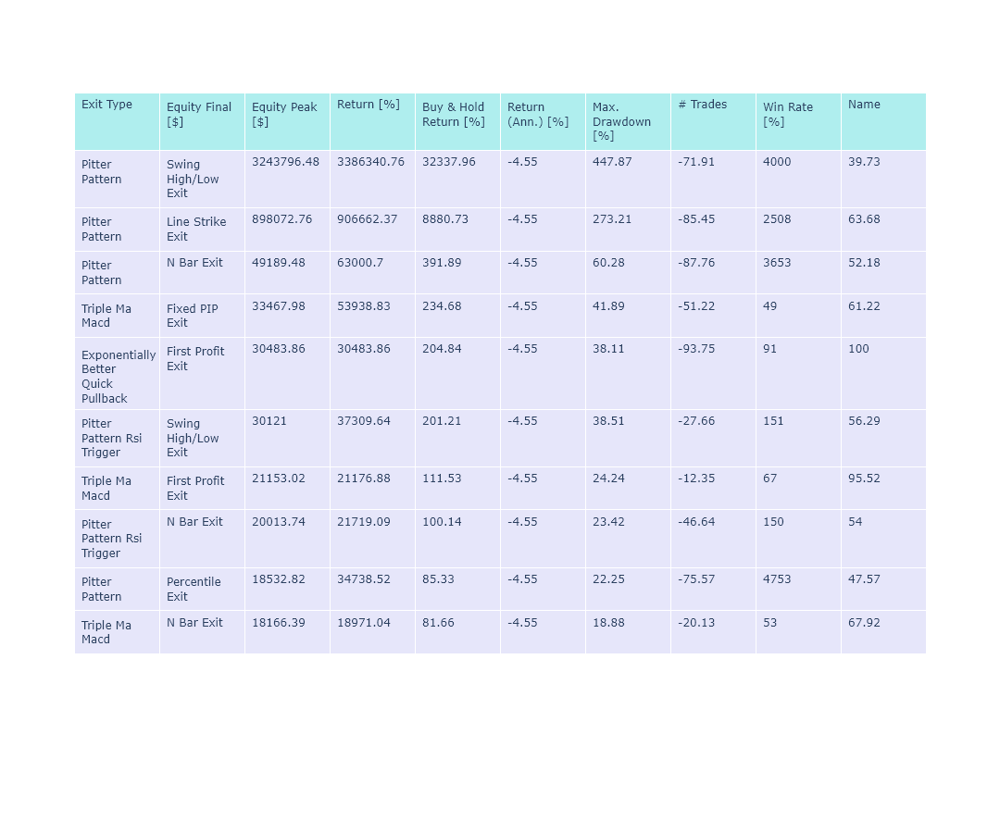
  </a>

## Support and Resistance

Are you interested in effortlessly uncovering support and resistance levels? We've got you covered! We've gathered a bunch of awesome techniques we discovered online to automate the detection of these crucial levels. Right now, we've got nine fantastic methods to share with you, but don't worry, we're always on the lookout for more and will keep expanding our collection.

Take a peek inside this folder, and you'll find all the code for these incredible methods. It's like having your very own treasure trove of support and resistance detection tools!

### Methods

Here is a list of the methods:

 - [x] Traditional 

 - [x] Fibonacci 

 - [x] DM

 - [x] Caramilla

 - [x] Kmeans Clustering

 - [x] Agglomerative Clustering

 - [x] Density 1

 - [x] Density 2

 - [x] Fractals 

Our aim is to create a python package called `supportresist` that will make it easy to compare and detect support and resistance levels. Here is a link to the [YouTube video](https://youtu.be/rzgJLdVh7vY) going through the methods and their results.

### References

This is the complete list of references that was were consulted. 

#### Blog Posts

 -  [Support Resistance Algorithm - Technical analysis](https://stackoverflow.com/questions/8587047support-resistance-algorithm-technical-analysis)

 -  [Detection of price support and resistance levels in Python](https://towardsdatascience.com/detection-of-price-support-and-resistance-levels-in-python-baedc44c34c9)

 - [How to Detect Support & Resistance Levels and Breakout using Python](https://medium.datadriveninvestor.com/how-to-detect-support-resistance-levels-and-breakout-using-python-f8b5dac42f21)

#### GitHub Repos

 - [Stock Support and Resistance Analysis](https://github.com/JOravetz/stock_support_resistance_analysis/tree/main)

 - [PriceLevels](https://github.com/day0market/support_resistance/tree/master)

#### Videos

- [Pivot Points Indicator in Python](https://www.youtube.com/watch?v=5RL_diLBJlI)

- [Auto-detect Support and Resistance in Python](https://www.youtube.com/watch?v=5OjX8r3DsmU)

- [SUPPORT & RESISTANCES with Python](https://www.youtube.com/watch?v=qZElw2uN1NI)

- [Market Profile and Support/Resistance Levels With Python](https://www.youtube.com/watch?v=mNWPSFOVoYA&t=262s)

## 20 pips challenge

You probably don't have $50 000, or $25 000 or $10 000 to start trading forex. Maybe we can start with $20 and grow it to over $50,000. The 20 pips challenge shows how you can grow your small account with at least 30 trades. See the image below.

  <a href="https://github.com/zeta-zetra/code">
    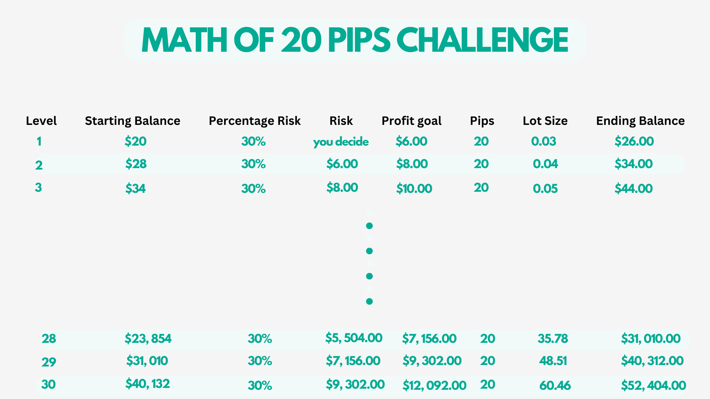
  </a>

This folder contains scripts that you can test to grow your $20 to over $50,000. You can check out the YouTube video [here](https://www.youtube.com/watch?v=eaDgOT7FEOA).

### 1. EMA, RSI and Fractals

This is a scalping strategy from the ["Moving Average" channel](https://www.youtube.com/@TheMovingAverage).

The strategy uses the Williams Fractals, the RSI and 3 moving averages, namely: the 21 MA, the 50 MA, and the 200 MA. The strategy is tested in the 15 min timeframe.

### 2. EMA Scalping 

Here is another scalping strategy but from a different YouTube channel called [CodeTrading](https://www.youtube.com/watch?v=ybmep_u5MeU). The strategy only uses three moving averages.
The 50 EMA, the 100 EMA and the 150 EMA. It was tested in the 15-minute time frame. 

## Automate Chart Patterns

> In his book, Encyclopedia of Chart Patterns , Thomas Bulkowski says, "To knowledgeable investors, chart patterns are not squiggles on a
  price chart; they are the footprints of the smart money." Let's follow the smart money...

As the folder name states, it contains scripts that automate the detection of chart patterns. Several algorithms can be used to identify chart patterns. We have marked the ones we have used so far:

 - [x] Pivot Points

 - [x] Argrelextrema

 - Kernel Regression

 - Perceptually important points 

 - Directional Change

 - Rolling window 

 - Clustering Algorithms

The idea is to implement all of the above algorithms and produce a Python library called `chart_patterns`. You can check out the YouTube videos discussing the patterns already automated
[here](https://www.youtube.com/@zetratrading/videos).

You can check out the sample outputs below.

### 1. Head and Shoulders Patterns

  <a href="https://github.com/zeta-zetra/code">
    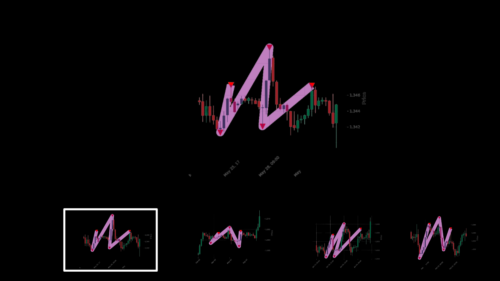
  </a>

### 2. Inverse Head and Shoulders Patterns

  <a href="https://github.com/zeta-zetra/code">
    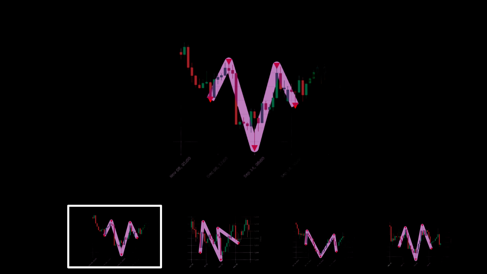
  </a>

### 3. Triple top and bottom Patterns

  <a href="https://github.com/zeta-zetra/code">
    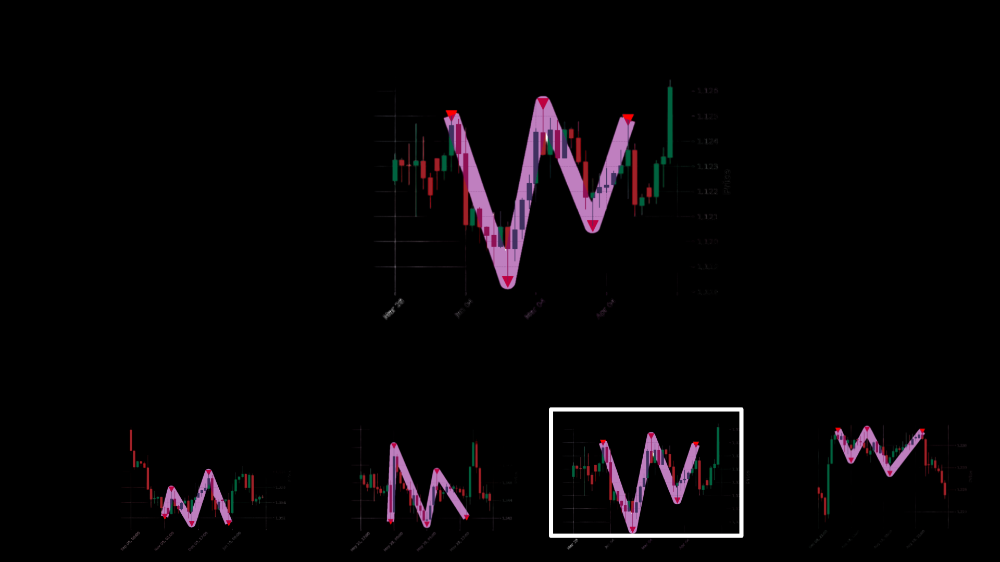
  </a>

### 4. Rectangle Patterns

  <a href="https://github.com/zeta-zetra/code">
    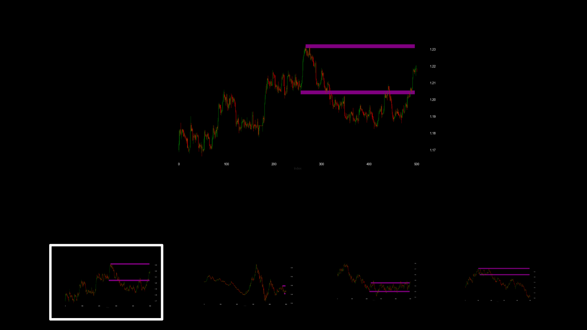
  </a>

### 5. Wedge Patterns

  <a href="https://github.com/zeta-zetra/code">
    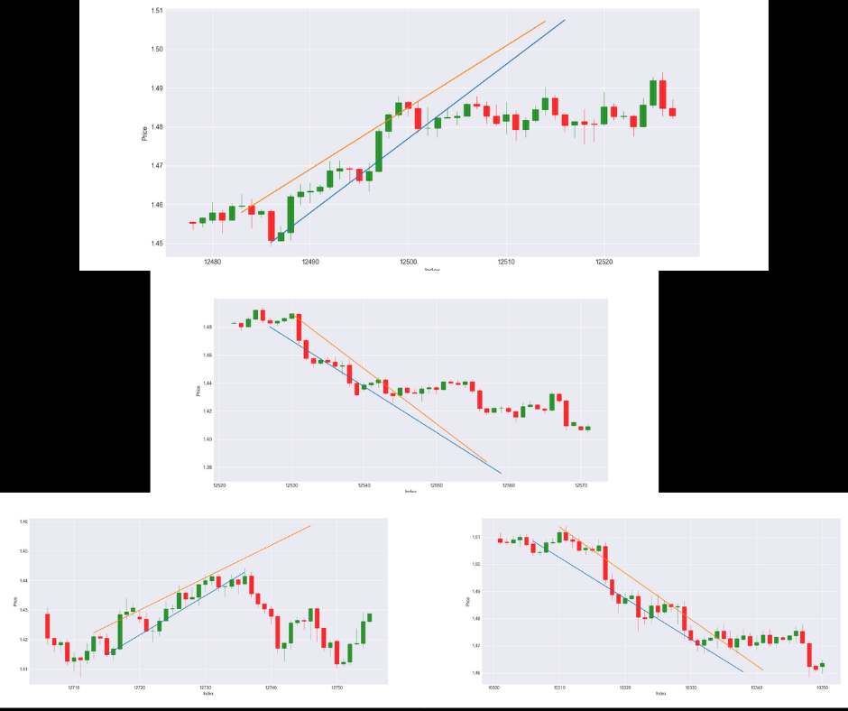
  </a>

### 6. Flag Patterns

  <a href="https://github.com/zeta-zetra/code">
    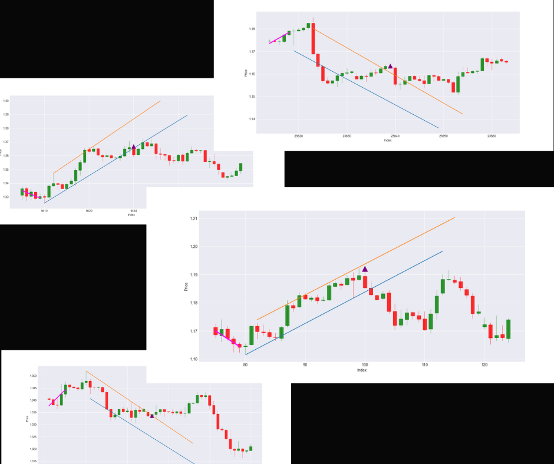
  </a>

## MACD
The script looks at the MACD strategy and tests it on 31 currency pairs. There are plenty of videos on YouTube on the MACD strategy. But there have the following in common:

 1. The focus is on a single currency pair.
 
 2. The backtest is applied in one timeframe.

 3. The backtest ends on 100 trades. 

We wanted to improve on this by doing the backtest on multiple currency pairs. On three time frames. And focus on more than 100 trades. You can watch the video [here](https://www.youtube.com/watch?v=RwEEOriVVx8&t=49s).
## Short Content

This folder has code that does not fit in other folders.

### 1. 42Dollars

> Please note this section was written by ChatGPT, Mar 23 version. 

Are you ready to be blown away? This script is not your average run-of-the-mill program. It was inspired by a Reddit post that left many Forex enthusiasts in awe. That's right, we're talking about the one and only 47dollars!

This Reddit user calculated correlations for a whopping [47 currency pairs](https://www.reddit.com/r/Forex/comments/zwr0ck/i_created_a_heat_map_showing_the_correlations/). And we thought that was impressive, until we decided to put our own spin on things. Our script, aptly named 42dollars, consists of 42 carefully selected pairs that will leave your mind boggled.

But wait, there's more! The script goes above and beyond by calculating a rolling correlation for each and every currency pair. That's right, you heard it here first. We're not just talking about static correlations, we're talking about correlations that evolve over time.

And to top it all off, we present to you a stunning heatmap of the results. It's like watching a work of art come to life before your very eyes. So buckle up and prepare to have your mind blown by the incredible power of the 42dollars script!

  <a href="https://github.com/zeta-zetra/code">
    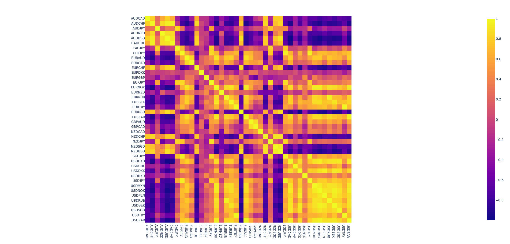
  </a>

You can also check out the [YouTube shorts video](https://www.youtube.com/shorts/BOHgtnwbfsY) of the final result. 

### 2. Bullish Candlesticks

This file calculates bullish candlestick patterns. Here are the candlestick patterns:

    - engulfing

    - harami

    - dragonfly doji

    - inverted hammer

    - morningstar

Here is a [YouTube shorts video](https://www.youtube.com/shorts/bV_Oq2U-itA) to the results of the script.      

## Retracement

Will the price bounce back? As traders we look for the levels prices will bounce back and continue its trend. These points of retracements can
serve as good entry points to catch the trend. 

We will use python to calculate different retracement levels. Currently the following have been implemented:

- [x] Distance

- [x] Fibonacci 

- [x] DM

- [x] Caramilla

- [x] Moving Average

Here are the methods for calculating the pivot points:

 - [x] High and Low (hilo)

 - [x] argrelextrema (arg)

 - [x] Fractals (frc)

 - [x] Perceptual Important Points (pips)

### Results

Here is a plot of one result when `condition` is set to `fibonacci`:

  <a href="https://github.com/zeta-zetra/code">
    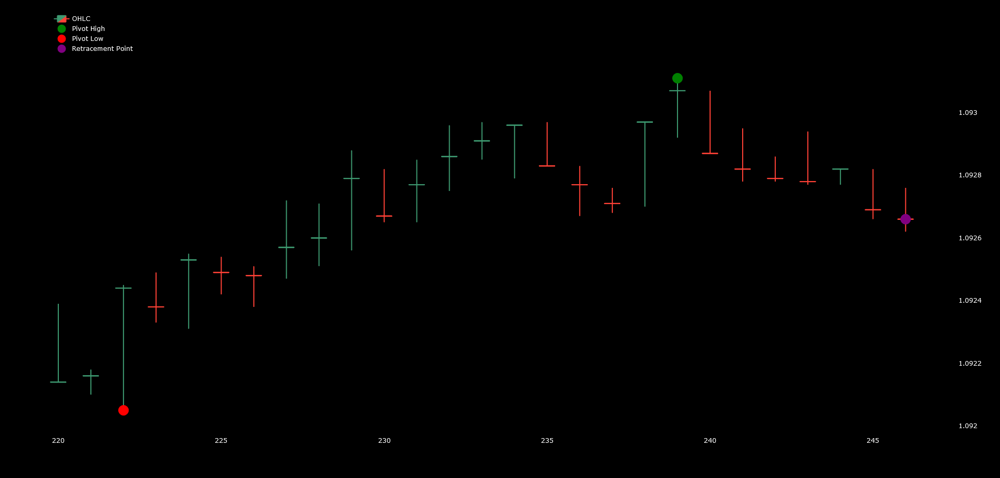
  </a>

Here is a result when `condition` is set to `distance`:

  <a href="https://github.com/zeta-zetra/code">
    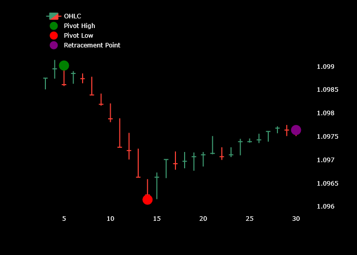
  </a>

The results are not perfect. But we will continue to work on it.

### Example of Trends and Retracements signal

The points found could potentially be reversals. To be "true" retracement points, the price has to be trending. There are many different ways to
measure or detect if price is trending. As an example we defined an `upward trend` as being when the close is greater than the 10-period moving average. 
A `downward trend` as being when the close is less than the 10-period moving average. 

Here is a gif of `all the signals`:

  <a href="https://github.com/zeta-zetra/code">
    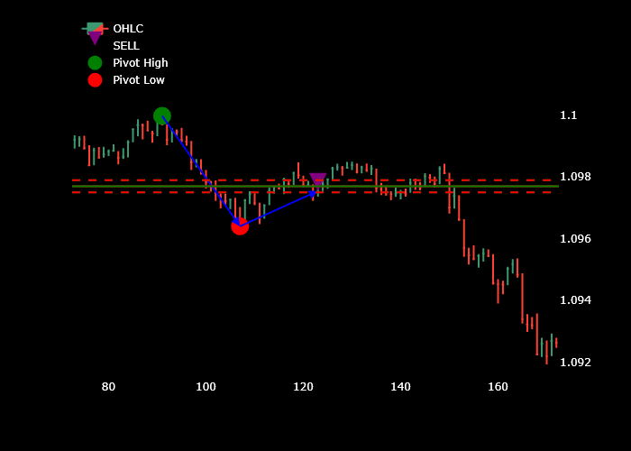
  </a>

### Retracement References

#### Blogs

1. [https://towardsdatascience.com/fibonacci-retracements-in-python-470eb33b6362](https://towardsdatascience.com/fibonacci-retracements-in-python-470eb33b6362)

#### Github Repos

1. [https://github.com/gianlucamalato/machinelearning](https://github.com/gianlucamalato/machinelearning/blob/master/Fibonacci_Retracements.ipynb)

2. [neurotrader888/TechnicalAnalysisAutomation](https://github.com/neurotrader888/TechnicalAnalysisAutomation/tree/main)

#### Videos

1. [Step-by-Step Guide to Building a Fibonacci Retracement Forex Trading Indicator in Python](https://www.youtube.com/watch?v=3rmw0UFgYmQ) 

## Code Trading

[CodeTrading](https://www.youtube.com/@CodeTradingCafe) is a YouTube channel where the hosts tests different trading strategies. He also gives access to the code. We
have decided to refactor the code and test them across different exits. Here is a gif for some of the results we found.

  <a href="https://github.com/zeta-zetra/code">
    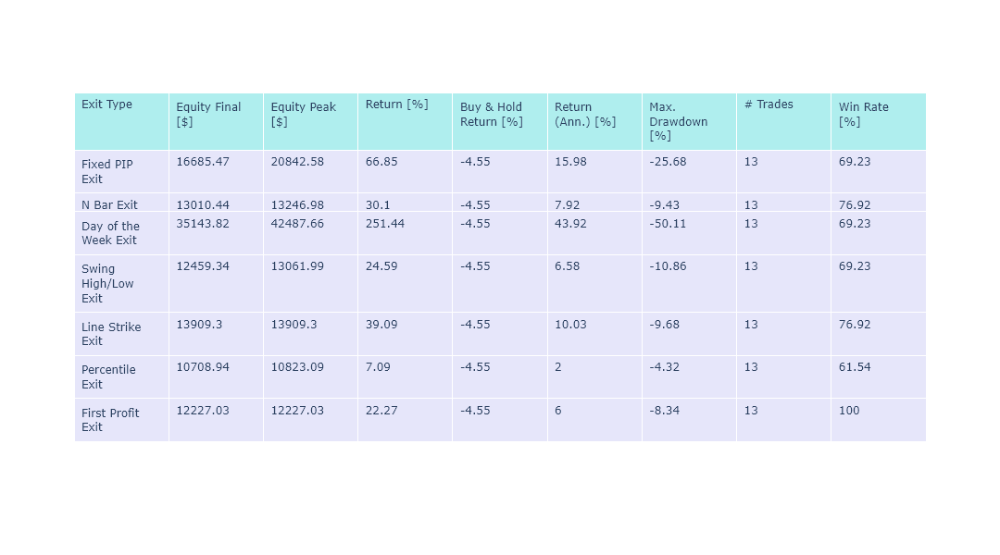
  </a>

You can find the playlist were we found the strategies [here](https://www.youtube.com/playlist?list=PLwEOixRFAUxZmM26EYI1uYtJG39HDW1zm). The channel is definitely worth checking out. **Highly recommended**

## Data

The data folder contains any files you will need to replicate the results found from testing, etc. This will usually be forex data
you can download from [Dukascopy](https://www.dukascopy.com/swiss/english/marketwatch/historical/). 

You can use our python library [forexpy](https://github.com/zeta-zetra/forexpy) to collect forex data from different sources.

Please note there is no affiliation with Dukascopy. 

## License
MIT

## Contact

You can reach me at  - info@zetra.io

## Buy me coffee

If you feel like buying me coffee, here is the [link](https://www.buymeacoffee.com/info90). Thank you. 

## Disclaimer 

We want to emphasize that this is purely for educational purposes only. We do not offer any financial advice, recommendations, or make any guarantees of profit or success. 
Trading carries a risk of loss, and it is important to always consult with a qualified professional before making any trading decisions.